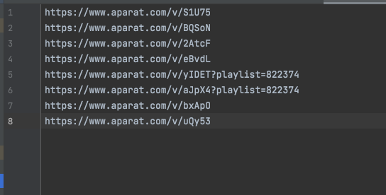

## Installation/Run scenario on Docker
At first you must to create shared folder with 2 files: 1- aparat_file.txt, 2- network_performance.db

in Unix-based systems:
```
mkdir /path/to/shared/ && cd /path/to/shared/
touch aparat_file.txt
touch network_performance.db
```
in Windows systems:

```
mkdir C:\shared 
cd C:\shared
type nul > aparat_file.txt
type nul > network_performance.db
```

edit aparat_file.txt and put an Aparat video link in the each line

then run the project with the bottom line:
```
docker run -v $(pwd)/aparat_file.txt:/usr/src/app/aparat_file.txt -v $(pwd)/network_performance.db:/usr/src/app/network_performance.db --rm -it f4ran/qoe-selenium
```

for windows systems:
```
docker run -v C:\shared\aparat_file.txt:/usr/src/app/aparat_file.txt -v C:\shared\network_performance.db:/usr/src/app/network_performance.db --rm -it f4ran/qoe-selenium

```
network_performance.db update live when application is running.

## Build from Dockerfile
Clone the project:
```
git clone https://github.com/F4RAN/qoe-selenium.git && cd qoe-selenium
```
then use this command for Linux 64-bit ARM platforms:
```
docker buildx build --platform=linux/arm64  -t qoe-selenium .
```


build for other platforms:

- linux/amd64 - Linux 64-bit x86
- linux/arm64 - Linux 64-bit ARM
- linux/arm/v7 - Linux ARMv7 32-bit
- linux/arm/v6 - Linux ARMv6
- linux/386 - Linux 32-bit x86
- linux/ppc64le - Linux PowerPC 64-bit
- linux/s390x - Linux IBM Z
- windows/amd64 - Windows 64-bit x86
- windows/arm64 - Windows ARM64
- darwin/amd64 - macOS x86 64-bit
- darwin/arm64 - macOS ARM64 Apple Silicon


## Installation scenario on Docker ( Windows )
Here is how you can install and run the project on Docker for Windows:


## Installation scenario on Ubuntu
first you should install git, python3 and ffmpeg:
```
sudo apt install git python3 ffmpeg
```
then install the required packages using the command below:
```
sudo apt-get install libavformat-dev libavdevice-dev libavfilter-dev libswscale-dev
```
To export ffmpeg_debug_qp to your PATH first you need to clone the following project:
```
git clone https://github.com/slhck/ffmpeg-debug-qp.git
```
Then navigate to the cloned directory:
```
cd ffmpeg-debug-qp
```
build the tool:
```
make
```
After building, you need to add the tool to your system's PATH.you can move the ffmpeg_debug_qp executable to /usr/local/bin:
```
sudo mv ffmpeg_debug_qp /usr/local/bin
```
Now, ffmpeg_debug_qp should be available system-wide. You can verify this by typing ffmpeg_debug_qp in your terminal. If it's correctly installed, you should see the usage instructions for the tool.
Please note that you need to have make installed on your system to build ffmpeg_debug_qp.

then you should install qoe-selenium project:
```
git clone https://github.com/F4RAN/qoe-selenium.git && cd qoe-selenium && pip3 install -r requirements.txt
```

## Installation scenario on macOS
this implementation just works on ffmpeg version 4
then you must install below packages:
```
brew install ffmpeg@4 pkg-config python3 git
```

after communication with main developer of [ffmpeg-debug-qp](https://github.com/slhck/ffmpeg-debug-qp/issues/38),
i found out we must to use this command after clone `ffmpeg-debug-qp` package 

```
export PKG_CONFIG_PATH="/opt/homebrew/opt/ffmpeg@4/lib/pkgconfig
```

and use `make` command to compile it root folder of `ffmpeg-debug-qp`
```
git clone https://github.com/slhck/ffmpeg-debug-qp.git && cd ffmpeg-debug-qp && make
```


then copy builded file to the with below command:

```
sudo cp ./ffmpeg_debug_qp /usr/local/bin/
```


so now [itu_p1203](https://github.com/itu-p1203/itu-p1203) standalone app can use the `ffmpeg_debug_qp` correctly.

then you should install qoe-selenium project:
```
git clone https://github.com/F4RAN/qoe-selenium.git && cd qoe-selenium && pip3 install -r requirements.txt
```

## Run App
Run comma separated links:
```bash
# Command
python3 app.py --link aparat_url_1,aparat_url_2,aparat_url_3 ...

# Example
python3 app.py --link https://www.aparat.com/v/BQSoN,https://www.aparat.com/v/eBvdL,https://www.aparat.com/v/2AtcF
```
Run file (each line including one link)
```bash
# Command
python3 app.py --file path/to/aparat_urls

# Example
python3 app.py --file ./aparat_file.txt
```
file structure: aparat_file.txt:




You must use compatible chromedriver of your os, you can use below link to download suitable version of chrome depended on your Chrome version:
https://chromedriver.chromium.org/downloads


## Database fields
`test_no`: number of test INTEGER,

`url`: url of video that we was testing it TEXT,

`timestamp`: date and time of testing DATETIME,

`delay`: from selenium in ms INTEGER,

`throughput`: from selenium in bps INTEGER,

`connection_time`: from selenium in ms INTEGER,

`ttfb`: time to first byte from selenium in ms INTEGER,

`content_load_time`: from selenium in ms INTEGER,

`mos`: *100 in INTEGER,

`initial_load_time`: from selenium in ms INTEGER,

`page_load_time`: from code ms INTEGER,

`css_load_time`: from selenium in ms INTEGER,

`js_load_time`: from selenium in ms INTEGER,

`video_load_time`: from selenium in ms INTEGER,

`html_load_time`: from selenium in ms INTEGER,

`video_width`: from selenium INTEGER,

`video_height`: from selenium INTEGER,

`main_video_duration`: video duration without advertise from selenium in ms INTEGER, 

`avg_frame_rate`: *100 from selenium INTEGER,

`startup_time`: from HAR in ms INTEGER,

`buffering_time`: from HAR in ms INTEGER,

`buffering_ratio`: from HAR in percent INTEGER,

`avg_buffering_time`: from HAR in ms INTEGER,

`total_size_with_buffer`: from HAR in bits INTEGER,

`avg_bitrate`: from HAR in kbps INTEGER,

`delay_qos`: from PING in ms INTEGER,

`jitter`: from PING in ms INTEGER,

`packet_loss`: from PING in percent INTEGER,

## Code changes
change `valid_video_exts` in `__main__.py`

    valid_video_exts = ["avi", "mp4", "mkv", "nut", "mpeg", "mpg"]

to

    valid_video_exts = ["avi", "mp4", "mkv", "nut", "mpeg", "mpg", "ts"]

<hr>

in `extractor.py` in `get_stream_size()` function change
    
    size = sum([l for l in stdout.split("\n") if l != ""])

to
    
    size = 0
    for l in stdout.split("\n"):
        if l != "":
            if l.find("|"):
                l = l.split("|")[0]
                size += int(l)
